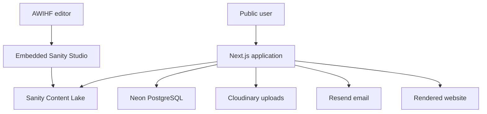

# System Architecture

## Overview

The AWIHF platform is a Next.js App Router application that combines public website content, operational form workflows, embedded Sanity Studio, and integrations with managed external services.

## Responsibility Boundaries

### Next.js

Next.js is the orchestration layer. It renders pages, hosts API routes, validates requests, coordinates external services, and exposes the embedded Studio route. It is not the permanent source of content or operational records.

### Sanity

Sanity is the content layer. It owns editable content such as homepage sections, about copy, programmes, news, stories, donation content, impact report content, leadership, partners, contact information, and global settings.

### Neon

Neon is the operational database. It owns contact submissions, newsletter subscribers, mentorship applications, application status, review metadata, and file metadata. It must not store CMS content.

### Cloudinary

Cloudinary stores uploaded user documents such as CVs and transcripts. Neon stores only the secure URL, public ID, file name, file size, and MIME type.

### Resend

Resend sends notifications and confirmations after successful persistence. It is never the source of truth.

## Business Workflow Order

Operational submissions must follow this order:

1. Validate request and rate limit.
2. Upload documents to Cloudinary when required.
3. Persist the operational record in Neon.
4. Send Resend notifications.
5. Return the response.

If Cloudinary upload fails, no database record is created. If database persistence fails after upload, uploaded assets are deleted. If Resend fails after persistence, the database record remains.

## Folder Structure

- `app/`: App Router pages, route handlers, metadata, sitemap, Studio route.
- `components/`: shared UI components, layout, forms, sections.
- `content/`: local emergency fallback content.
- `db/`: SQL schema for Neon.
- `docs/`: operational and engineering documentation.
- `lib/config/`: environment parsing and configuration.
- `lib/content/`: content access layer for Sanity-backed website content.
- `lib/db/`: operational data access layer.
- `lib/email/`: Resend adapter and email templates.
- `lib/http/`: request context, rate limiting, submission utilities.
- `lib/observability/`: structured application logging.
- `lib/security/`: admin route authentication.
- `lib/storage/`: Cloudinary upload and cleanup logic.
- `lib/validation/`: request validation and file validation.
- `prisma/`: Prisma schema and config for generated client access.
- `sanity/`: schemas and Studio structure.
- `scripts/`: operational scripts for backup and restore.

## Content Flow

Pages should request editable content through `lib/content/*` utilities. Page components should not embed raw GROQ queries. This keeps Sanity implementation details centralized.

## Operational Data Flow

API routes should use the validation layer, `getSubmissionContext`, `lib/db/operations`, `lib/storage/cloudinary`, and `lib/email/resend`. Route handlers should coordinate workflow order but should not contain provider-specific implementation details.

## Deployment Model

The project is designed for Vercel. Runtime secrets are supplied through Vercel environment variables. Production content is served from Sanity and operational data is stored in Neon.
